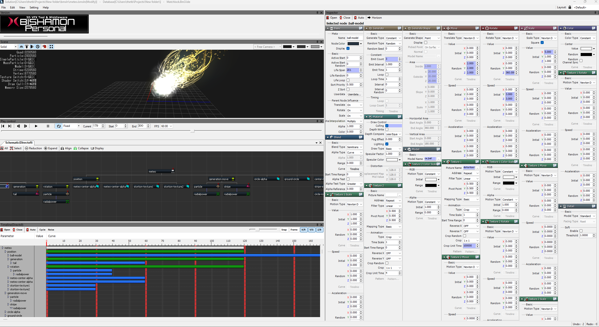
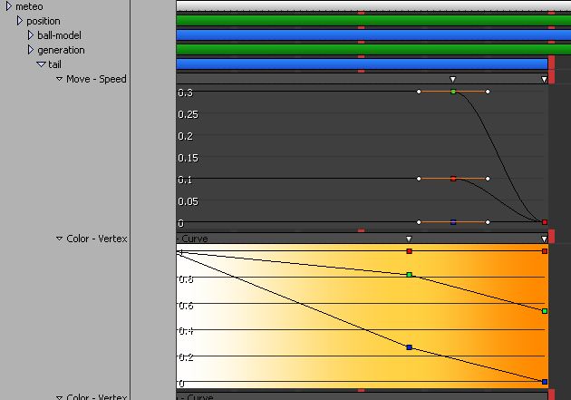

# Reversing the BMB
## Background
FFBE is built on a few plugin processes to drive the visuals; it uses [Cocos2d](https://www.cocos.com/en/cocos2d-x) for most of the UI, however it uses Matchlock's [BISHAMON](https://www.matchlock.co.jp/en/) tool for 3D particle/geometry effects. These effects are self-contained binary files (.BMB) that take textures and create a mini 'scene' where it will manipulate, move, fade, color, all sorts of transformations to generate a timed special effect. 

## The challenge 
we are decompiling a very complex binary: BISHAMON is a node based workflow that has numerous emission and transformation nodes that can nest, and all of this is stripped down to just bits. This is like doing a math problem in reverse: the answer is 50, but you have to identify exactly what the initial problem is (could be 49+1, could be 25*2, could be "what's my favorite number?"). The way these files are created is, as the artist is creating the effect in BISHAMON, they are working with a .BMSLN file (the source code), which is just a fancy XML file. Perfectly readable, and used to structure the whole node tree layout and store the various parameters. When these are compiled, they undergo intense compaction and optimization, practically all the tags are stripped, patterns are serialized, and a byte-offset map is created. This reduces the size greatly, and loses a lot of the information we need, as the engine is just looking at a specific byte location for the correct value. 

## The Goal
So, my main goal was to get scene fidelity; can we replicate the effect in Godot or any other modern 3D engine? The good answer is we can kinda get close. The bad answer is; there are over 9,000 effects (pun intended but accurate), so eyeballing them wasn't really an option, we need to automate this, which means taking those binaries and somehow extract the meaning behind them. I had set as a measure of success effectively reconstituting the source .BMSLN file, which again is just an XML file, and because all the parameters are pretty standard modifications, we can create a 'recipe' book that translates what BISHAMON did into something that GODOT can do.

## Pass #1: Brute force
***the_TBMonkey Summons GHIDRA!!***

Ghidra is a free and open-source software reverse engineering framework developed by the United States National Security Agency (NSA). It's a very powerful tool that allows us to read the binary and understand what it represents. Now, while all the metadata (tags, structure) is effectively lost, we still have clues such as regular text that gives hints to the structure of the file. As the files are structured uniformly, taking a few and seeing the pattern changes, we can figure out some necessary patterns, but most of a file is still an unknown pile of 0s and 1s. I was hoping that BISHAMON works similar to other well-known engines like Unity or Unreal, as I could work through those to figure out how a file gets compiled, however we quickly found out it is not like those engines.  

## Research uncovers a path
Ruling out a familiar engine, I started to research about BISHAMON directly. It was mainly used by Japanese game companies, and it's latest version was released in 2015. Pleasantly the company's website is still up and running (albeit with very little activity), but I was able to scope out what it looked like. However more critically, I uncovered something major: they are still selling BISHAMON, and they have a free trial version!

## Pass #2: Build it ourselves
So, the big gamechanger is if I have access to the program, and more importantly to its compiler. Thus we can be more strategic in our approach; BISHAMON comes with some demo files with their own, so I can take a source .BMSLN file and convert it into a .BMB and start seeing where bits land. This also gives us a view of the underlying XML structure as well:

### .BMSLN format
So, a .BMSLN workspace is effectively a pile of nodes. Each 'node' consists of about 393 XML elements. The good thing is each node has exactly the same set of elements in the same order, even if those parameters are not used in that node. 

And with the set of Demo files, I was able to quickly outline where the node markers in the binary are, and generally in a few passes had about 70% of the structure identified. The more complicated part was identifying exactly how the compiler was collecting and compressing these files, and what was causing my 'assumed' bitflips to not be correct. For the most part I had a black box: take a source file, throw it into the black box, and get a resulting binary. Make a tiny change, throw it through the black box again, and get a slightly different binary. A really tedious process as I'm tring to unsnarl how each parameter affects the serialized sequence. 

But, after quite a while, I was able to reverse a very simple file perfectly: take the source file, put it into the black box, take the resulting binary and completely reverse it, then throw it back into the box. Both the original binary and the one from my decompiler were bit perfect! 

## Curves threw me for a curve!
However, I ran into a very hard wall; CURVES! 

So in Bishamon, a lot of effects can change over time. This change can be constant (e.g. 0.5 over 60 frames) but a lot of parrameters can be variable over a timeline. This is easy to do in a graph, just add splines or constants and shuffle them around, but in the XML file these have to be represented by a complicated timeline matrix that isn't initialized unless defined. So, this sort of breaks the flow; we're adding in a lot of vector fields randomly into the binary mix which really effects the serialization in ways that are hard to trace. So, more and more bruteforce adding/removing curves and seeing how the binary is compiled. 

## Pass #3: Wait, I have a hammer here
So, the blackbox was annoying, trying to figure out its pathways. But, hey I have this huge GHIDRA shaped hammer here, why don't I just crack open this blackbox? 

I did that.

So, the compiler is called bmconv.exe, and decided best way to figure out what these pathways are is directly read them. Decompiled bmconv.exe directly (actually it's a mixed mode .exe, had both x86 and CIL elements, so along with Ghidra I had to use another decompiler called ilspycmd) along with a companion .dll, which then laid bare how the compiler actually modifies a source file and builds the binary. This helped drastically, as this outlined all the pointers and offsets for each element and gave the recipe on how it gathers these fields together and serializes them. This doesn't make the work automatic, but it certainly allows us to double check our work.

## Tidying up things
So, after grinding on this for I want to say two weeks, we are now finally mainly converted through all the demo files. The good thing is these demos were designed to show off most of the node and parameters, so it generally covered all the elements we needed to decode, and this created a nice python reverser that will take a BMB file and give a source-faithful .BMSLN reproduction. The final parts have been actually going through and seeing how real FFBE files work. 

## What comes next?
After this, I'll start opening up what files I have. We'll need to build a way to 'interpret' how these effects can be converted into Godot scenes, as well as how the actual Cocos2D engine worked and manipulated these scenes. This might be a bit of finessing, but I'm confident we now have all the information I can glean out of these binaries.
